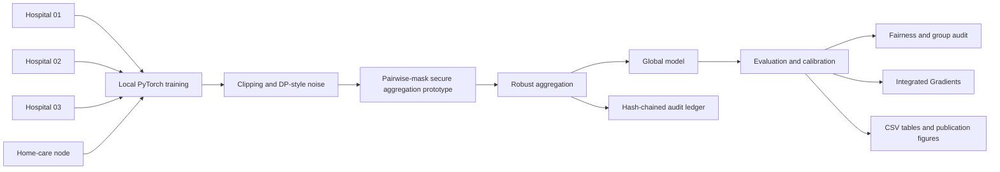
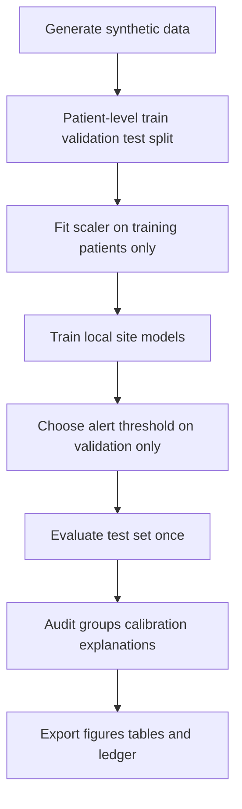

# CareFed-TrustLab

> **Independent academic research prototype for privacy-preserving and trustworthy federated learning in connected healthcare.**

[](../../actions/workflows/research-checks.yml)

CareFed-TrustLab is a research infrastructure project for studying whether simulated hospitals and a home-care node can collaboratively train a clinical-deterioration model **without exchanging raw patient-level data** while measuring privacy, robustness, fairness, calibration, explainability, and auditability.

> **Independence statement:** This is an independent personal research prototype. It is not an official University of Oldenburg, Connected Health Nordwest, OFFIS, DFKI, or University Medicine Oldenburg project.

---

## Research question

**Can federated learning across distributed healthcare providers retain useful predictive performance while exposing less information, resisting malicious participants, and producing evidence that is auditable and interpretable?**

### Research questions

| ID | Question | Evidence generated |
| --- | --- | --- |
| RQ1 | How does federated learning compare with centralized and local-only learning? | Baseline metrics and site-level results |
| RQ2 | What privacy–utility trade-off appears as update noise changes? | F1, ROC-AUC, calibration, ECE, approximate epsilon |
| RQ3 | Which aggregation method is more resilient to malicious client updates? | FedAvg, secure FedAvg, coordinate median, trimmed mean |
| RQ4 | Do outcomes differ by age band, sex, care setting, or site? | Group audit, recall/F1/positive-rate gaps |
| RQ5 | Can each experiment be reproduced and inspected later? | Configs, figures, CSV bundle, hash-chained ledger |

---

## Visual system overview



Detailed diagrams and output maps are available in [`docs/diagrams.md`](docs/diagrams.md).

---

## Why it is aligned with secure and trustworthy healthcare AI

| Research theme | CareFed-TrustLab implementation |
| --- | --- |
| Privacy-enhancing technologies | clipped updates, DP-style noise experiments, approximate privacy budget |
| Applied cryptography | pairwise-mask secure aggregation teaching prototype with explicit assumptions |
| Secure collaborative processing | multi-site federated PyTorch training |
| Robustness | label-flip, sign-flip, and scaled-update attack simulations |
| Trustworthy AI | calibration, expected calibration error, group audit, disparity gaps, explanations |
| Explainability | Integrated Gradients feature attribution export |
| Auditability | hash-chained ledger records every federated round |
| Interdisciplinary work | student lab, workshop outputs, MATLAB figures, paper outline |

---

## Dataset: synthetic connected-health telemetry

No real patient data are included. The generator creates simulated longitudinal observations across hospital and home-care settings.

| Category | Variables |
| --- | --- |
| Site structure | hospital nodes and a home-care node |
| Audit attributes | age band, sex, care setting, site |
| Vital-sign-style features | heart rate, blood pressure, respiratory rate, oxygen saturation, temperature, glucose |
| Contextual features | mobility score, adherence, care-contact minutes |
| Research outcome | synthetic deterioration label |

Read the complete data dictionary in [`data/README.md`](data/README.md).

Create a synthetic cohort:

```python
from carefed.data import SyntheticClinicalConfig, save_synthetic_dataset

save_synthetic_dataset(
    "data/synthetic_connected_health.csv",
    SyntheticClinicalConfig(n_patients=720, n_sites=6, time_steps=12, seed=42),
)
```

---

## Core research safeguards



- Synthetic data only; no clinical deployment claim.
- Patient-level split prevents the same synthetic patient appearing in multiple partitions.
- Feature scaler is fitted on the training partition only.
- Alert threshold is selected on validation data and then fixed for testing.
- Secure aggregation is explicitly scoped as a teaching prototype, **not** a full MPC implementation.
- The privacy budget is an approximation until a formal accountant such as Opacus is integrated.

---

## Implemented research modules

```text
src/carefed/
  data.py             synthetic multi-site connected-health telemetry
  preprocessing.py    training-only scaling, patient leakage checks, longitudinal summaries
  model.py            PyTorch clinical-risk model and local optimization
  federated.py        federated orchestration with validation-only thresholding
  baselines.py        centralized pooled and local-only comparisons
  privacy.py          update clipping, noise injection, epsilon approximation
  aggregation.py      FedAvg, median, trimmed mean, secure-aggregation prototype, ledger writing
  attacks.py          label flip, sign flip, scaled update attacks
  heterogeneity.py    controlled non-IID site-shift experiments
  evaluation.py       ROC, PR, calibration, ECE, threshold selection, bootstrap intervals
  trust.py            group audit and disparity summaries
  explain.py          Integrated Gradients feature attribution
  visuals.py          ROC, calibration, subgroup-gap, and privacy–utility figures
  experiments.py      privacy sweeps, robustness matrix, result-bundle export
  governance.py       data-use declaration and export boundary controls
  ledger.py           audit-ledger verification
  checks.py           deterministic smoke check for CI
  cli.py              command-line experiment entry point
```

---

## Installation

### Conda

```bash
conda env create -f environment.yaml
conda activate carefed-trustlab
```

### Pip

```bash
python -m pip install numpy pandas scikit-learn scipy torch matplotlib PyYAML pytest jupyter
```

From the repository root, use the source package directly:

```bat
set PYTHONPATH=src
```

macOS/Linux:

```bash
export PYTHONPATH=src
```

---

## Run an end-to-end experiment

```bash
python -m carefed.cli --patients 720 --sites 6 --rounds 4 --aggregation secure_fedavg --output results/baseline
```

Try a robustness experiment:

```bash
python -m carefed.cli --aggregation median --attack sign_flip --output results/median_sign_flip
```

Try a non-private reference run:

```bash
python -m carefed.cli --no-privacy --aggregation fedavg --output results/non_private
```

The result bundle contains:

```text
metrics.csv
roc.csv
precision_recall.csv
calibration.csv
group_audit.csv
group_gap_summary.csv
integrated_gradients.csv
roc_curve.png
calibration_curve.png
group_gaps.png
audit_ledger.jsonl
```

---

## Experiment portfolio

| Study | Purpose | Main artifacts |
| --- | --- | --- |
| Centralized vs federated | Quantify the cost of retaining data locally | F1, AUC, ECE, group audit |
| Local-only baseline | Identify the benefit of collaboration | per-site metrics |
| Privacy–utility sweep | Study different update-noise levels | epsilon vs F1 graph |
| Robust aggregation matrix | Test resilience to malicious updates | aggregation × attack table |
| Non-IID site shift | Stress multi-site distribution mismatch | site distribution report |
| Group audit | Detect performance disparities | recall/F1/positive-rate gaps |
| Explainability | Inspect dominant model features | Integrated Gradients CSV |
| Audit verification | Validate ledger integrity | hash-chain verification result |

Study configurations are provided in [`configs/`](configs/). See [`docs/experiment_design.md`](docs/experiment_design.md) for the full matrix.

---

## MATLAB analysis

MATLAB scripts are included for a research workflow that requires both Python and MATLAB:

```matlab
addpath('matlab')
plot_trust_results('results/baseline')
compare_privacy_utility('results/privacy_utility.csv')
friedman_aggregation_test('results/repeated_aggregation_metrics.csv')
```

| Script | Output |
| --- | --- |
| `matlab/plot_trust_results.m` | Subgroup-gap chart from exported audit results |
| `matlab/compare_privacy_utility.m` | Privacy–utility curve |
| `matlab/friedman_aggregation_test.m` | Repeated-seed aggregation comparison |

---

## Jupyter and student supervision material

- [`notebooks/federated_trust_walkthrough.ipynb`](notebooks/federated_trust_walkthrough.ipynb): guided research walkthrough.
- [`workshops/student_lab.md`](workshops/student_lab.md): 90-minute student lab, questions, and outputs.
- [`paper/manuscript_outline.md`](paper/manuscript_outline.md): paper-ready research structure.
- [`docs/threat_model.md`](docs/threat_model.md): asset, actor, and attack boundary.

---

## Reproducibility and CI

A GitHub Actions workflow installs core dependencies and runs a deterministic smoke check on every push and pull request. The smoke check generates a synthetic cohort, runs a short federation, checks patient-split isolation, and verifies the audit ledger.

Run it locally:

```bash
python -c "from carefed.checks import run_smoke_checks; print(run_smoke_checks())"
```

---

## Security and limitation statement

CareFed-TrustLab is not a medical device, clinical decision system, full secure-MPC implementation, or privacy-compliance product. It intentionally avoids overstated security claims. Its default synthetic results describe the configured generator, not real hospital performance. Real-world validation would require an approved protocol, legal basis, data-protection review, secure deployment environment, and external validation plan.

---

## Citation-style statement

> CareFed-TrustLab is an independent research prototype for auditable privacy-preserving federated learning in connected healthcare. It combines synthetic multi-site health telemetry, local PyTorch training, privacy-aware update handling, pairwise-mask aggregation simulation, robust aggregation, malicious-client experiments, calibration and subgroup auditing, Integrated Gradients explanations, MATLAB analysis, and a hash-chained experiment ledger.
