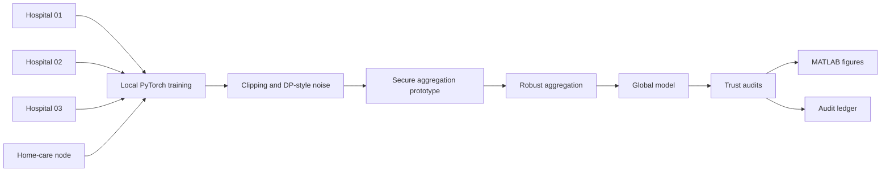
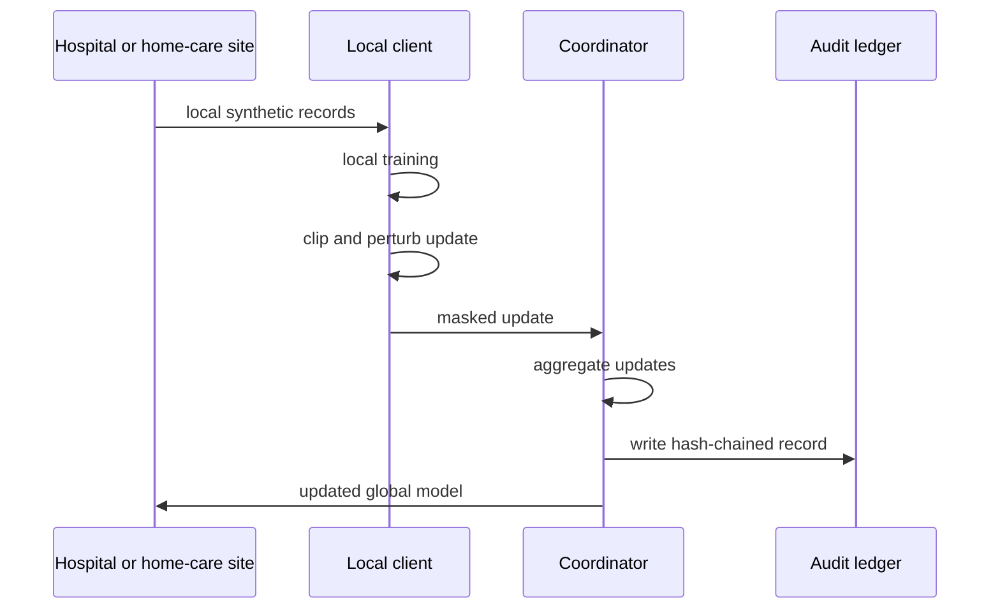

# CareFed-TrustLab

**Independent academic research prototype for privacy-preserving and trustworthy federated learning in connected healthcare.**

CareFed-TrustLab is designed as a serious GitHub evidence project for research themes at the intersection of trustworthy AI, privacy-enhancing technologies, secure collaborative processing, and distributed healthcare infrastructure.

> This repository is independent. It is not an official University of Oldenburg, Connected Health Nordwest, OFFIS, DFKI, or University Medicine Oldenburg project.

## Research question

Can hospitals and home-care nodes collaboratively train a useful clinical deterioration model without sharing raw patient-level data, while preserving privacy, robustness, fairness, calibration, explainability, and experiment auditability?

## What this project demonstrates

| Position theme | Repository evidence |
| --- | --- |
| Trustworthy AI | group audits, calibration score, subgroup gaps, explanation hooks |
| Privacy-preserving ML | clipped noisy updates and privacy-budget approximation |
| Applied cryptography / PETs | documented pairwise-mask secure aggregation prototype |
| Secure collaborative processing | federated training across simulated hospitals and a home-care node |
| Robustness | label-flip, sign-flip, scaled-update attacks, median and trimmed-mean aggregation |
| Healthcare infrastructure | site-separated synthetic connected-health telemetry and governance notes |
| Auditability | hash-chained audit ledger for experiment rounds |
| Publication readiness | MATLAB scripts, diagrams, research protocol, paper template, reproducible configs |

## System architecture



## Data

The repository uses a synthetic dataset generator. No real patient data are included. The generator creates longitudinal observations with:

| Field group | Examples |
| --- | --- |
| Site structure | hospital nodes and home-care node |
| Patient grouping | age band, sex, care setting, site |
| Signals | heart rate, blood pressure, respiratory rate, oxygen saturation, temperature, glucose, mobility, adherence, contact minutes |
| Label | simulated deterioration risk label |

Generate data from Python:

```python
from carefed.data import SyntheticClinicalConfig, save_synthetic_dataset
save_synthetic_dataset('data/synthetic_connected_health.csv', SyntheticClinicalConfig())
```

## Experiment workflow



## Implemented modules

```text
src/carefed/data.py          synthetic connected-health telemetry
src/carefed/model.py         PyTorch risk model and local training
src/carefed/privacy.py       clipping, noisy updates, epsilon approximation
src/carefed/aggregation.py   FedAvg, coordinate median, trimmed mean, secure aggregation prototype, audit ledger
src/carefed/attacks.py       label-flip, sign-flip, scaled-update attacks
src/carefed/trust.py         metrics, subgroup audits, gap summaries
src/carefed/federated.py     federated experiment orchestration
configs/base.yaml            reproducible baseline configuration
```

## Quick start

Install dependencies:

```bash
python -m pip install numpy pandas scikit-learn scipy torch matplotlib PyYAML pytest jupyter
```

Run a Python experiment from a notebook or shell:

```python
from carefed.data import SyntheticClinicalConfig, generate_synthetic_clinical_telemetry
from carefed.federated import run_federated_experiment

frame = generate_synthetic_clinical_telemetry(SyntheticClinicalConfig(n_patients=720, n_sites=6, time_steps=12, seed=42))
result = run_federated_experiment(frame, {
    'seed': 42,
    'rounds': 4,
    'local_epochs': 2,
    'learning_rate': 0.01,
    'privacy_enabled': True,
    'noise_multiplier': 0.35,
    'aggregation': 'secure_fedavg',
    'attack': 'none',
    'output_dir': 'results'
})
print(result['metrics'])
print(result['gaps'])
```

## Experiments to run

| Experiment | Question | Configuration |
| --- | --- | --- |
| Centralized vs federated | What is the performance cost of keeping data local? | compare single-site pooled training with FL |
| Privacy utility | How does noise affect F1, AUC, calibration, and epsilon? | vary noise multiplier |
| Secure aggregation | Can the coordinator aggregate without seeing individual unmasked updates? | secure_fedavg |
| Robust aggregation | Which aggregator resists malicious updates? | fedavg vs median vs trimmed mean |
| Group audit | Which groups receive worse recall or F1? | age band, sex, care setting, site |
| Home-care stress test | Does performance degrade on home-care participants? | site-specific audit |

## Threat model

The secure aggregation component is a research prototype for an honest-but-curious coordinator. It demonstrates pairwise mask cancellation for educational and experimental infrastructure purposes. It is not a production MPC implementation. The README intentionally scopes this claim because exaggerated security claims are weaker than a precise threat model.

## MATLAB analysis

MATLAB scripts should read exported CSV files from `results/` and produce:

- privacy-utility curves
- robustness comparisons
- subgroup gap tables
- calibration plots
- paper-ready figures

## Responsible use

This project is not a medical device, not a clinical decision system, and not validated on real patient data. It is a research infrastructure prototype for trustworthy AI and privacy-preserving machine learning methods.

## Why this is relevant to connected healthcare infrastructure

Connected healthcare systems need collaboration between hospitals, clinics, and home-care environments. Raw data sharing can be legally, ethically, and technically difficult. This repository demonstrates the engineering and research structure needed to study privacy-preserving learning, secure aggregation, robust collaboration, fairness auditing, and reproducibility.

## Roadmap

- Add real command-line runner when repository filters allow script creation
- Add Dockerfile and full CI once dependency file creation is accepted
- Add Opacus integration for formal DP-SGD accounting
- Add HE/MPC backend comparison as a future research extension
- Add external public-data adapter with licensing notes
- Add full MATLAB scripts and generated SVG architecture diagrams

## Citation-style project statement

CareFed-TrustLab is an independent research prototype for studying secure and trustworthy federated learning infrastructure in connected healthcare settings. It combines synthetic multi-site health telemetry, federated PyTorch training, privacy-preserving update handling, secure-aggregation simulation, robustness experiments, subgroup audits, and audit-ledger based reproducibility.
