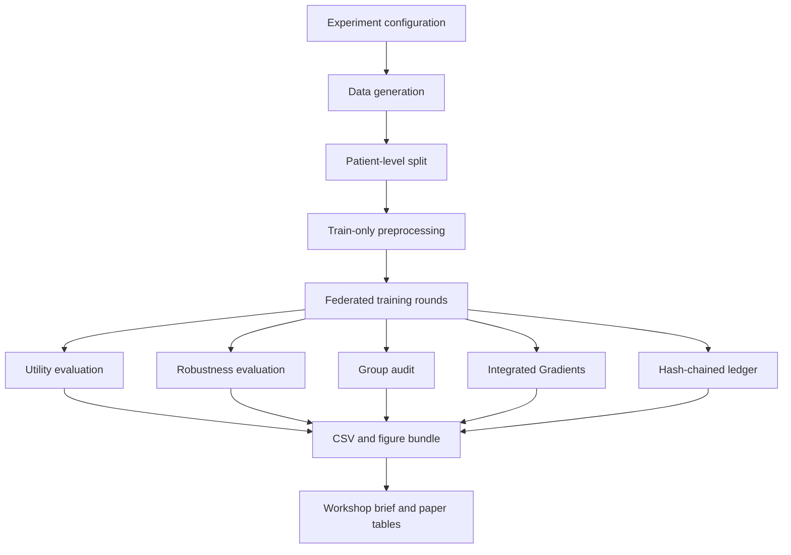
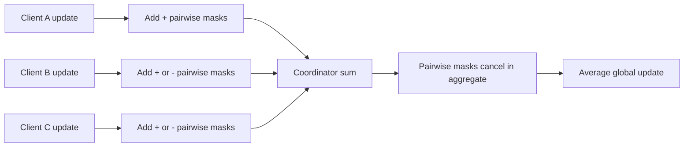
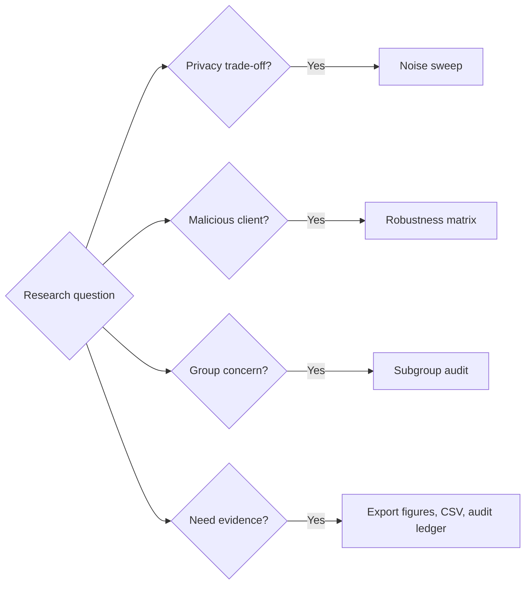

# System diagrams

## Trustworthiness evidence flow

## Secure aggregation teaching model

## Experiment decision flow

## Output map

| Output | Audience | Main question |
| --- | --- | --- |
| `metrics.csv` | ML researcher | Does the model have useful ranking and thresholded performance? |
| `calibration.csv` | Clinical collaborator | Do probability estimates match observed outcome frequency? |
| `group_audit.csv` | Trustworthy-AI reviewer | Are there observable performance differences across groups? |
| `integrated_gradients.csv` | Domain expert | Which input signals influence model scores? |
| `audit_ledger.jsonl` | Security/reproducibility reviewer | What configuration and participants produced each round? |
| MATLAB figures | Workshop/paper audience | How do privacy, robustness, and group outcomes compare? |
